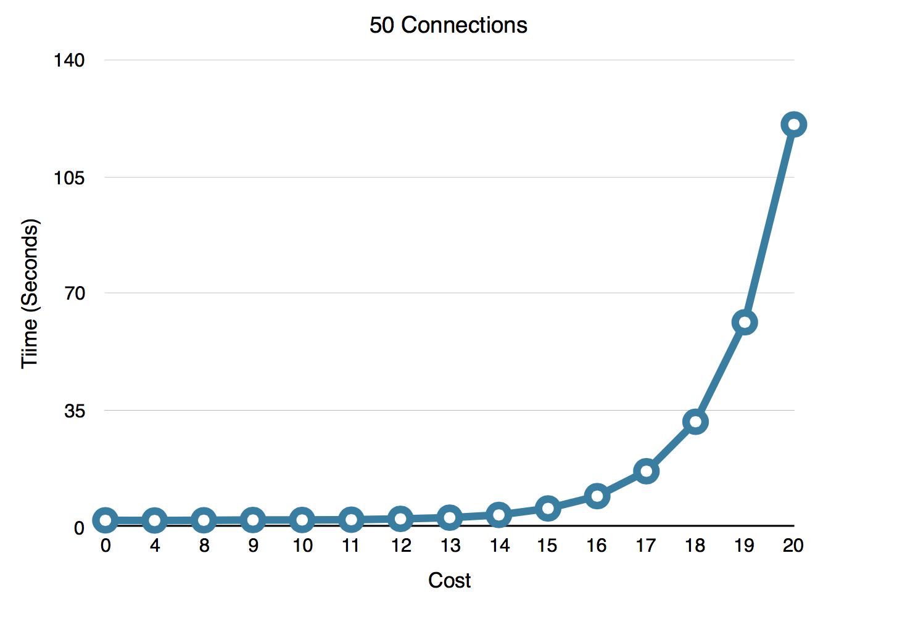
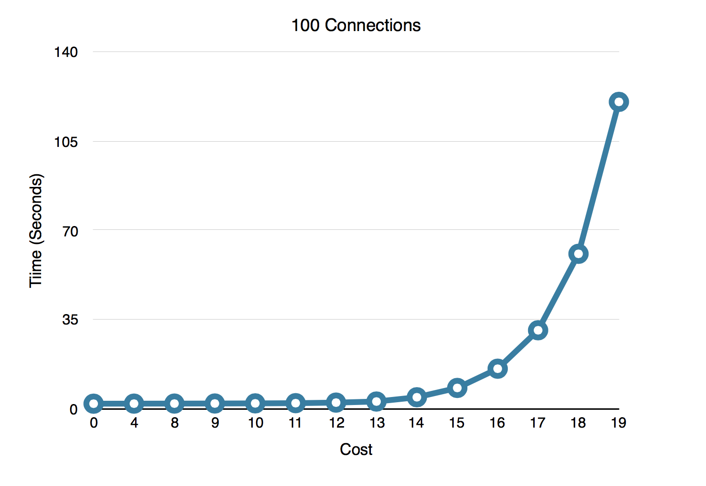
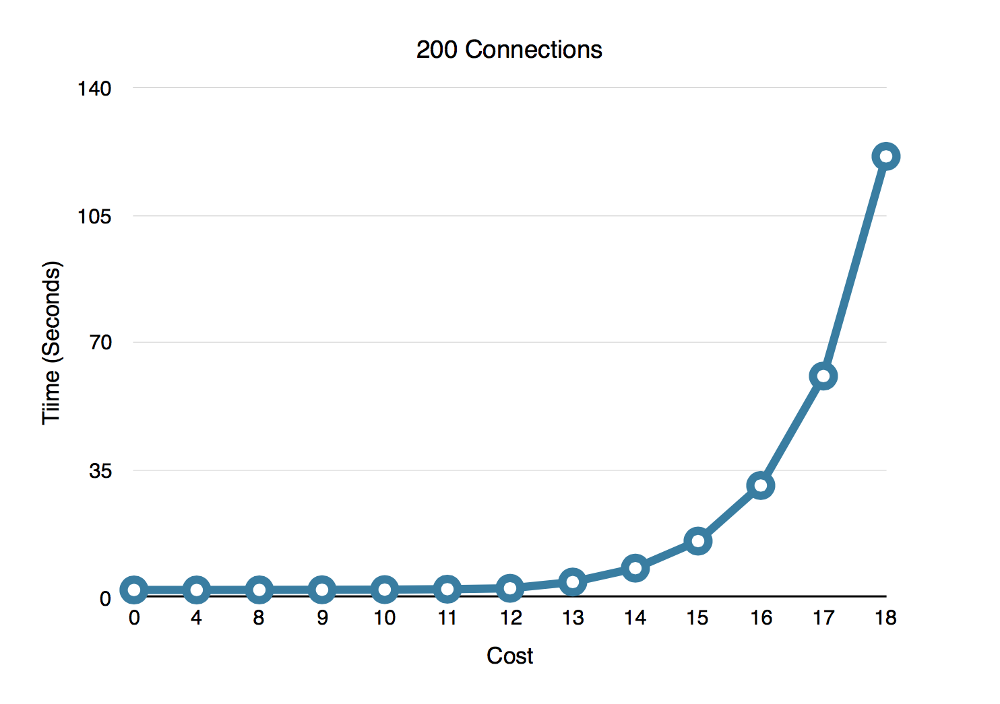
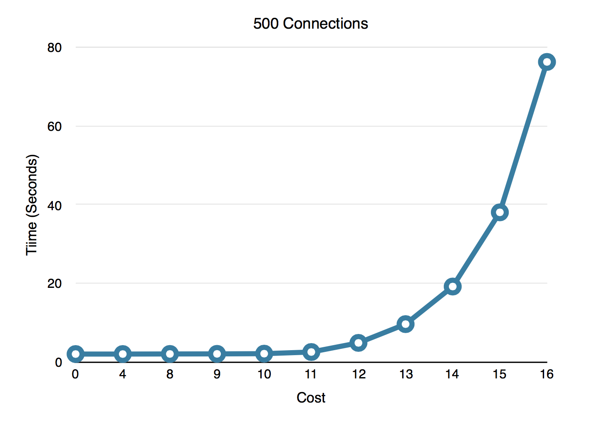
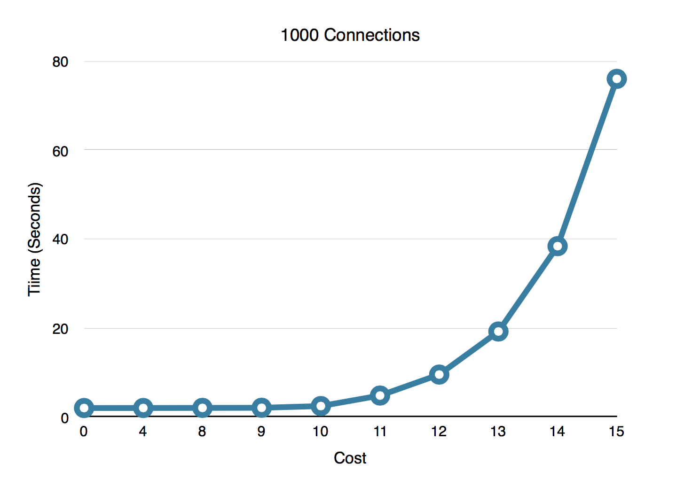

# Test Results

This test shows a trend and approximates where higher bcrypt costs (# of rounds) have an impact on performance with large numbers of connections being authenticated. Results are from a strained macbook pro.

* `cost_0` is no hashing, straight password compare.
* `cost_16` is using a bcrypt hash with 16 rounds.

The NATS server password utility default is 11 at the time of this test.

Command used to generate password:
` go run mkpasswd.go -c <count> -p`, password is `password`

**Total Connect time** is the total amount of time taken for all connections to connect somewhat simultaneously to the server.  There is a random wait between 0 and 2 seconds to prevent I/O errors due to resource contraints, so an optimal result should be around 2 seconds when resources are available.

Be sure system resources are available.  e.g. `ulimit -n 1024`

Not all tests were able to complete using a bcrypt cost of 20 due to connection errors.

View results in [PFD](./ConnBcryptCostResults.pdf) or [Numbers](./ConnBcryptCostResults.numbers)

## 50 Connections

## 100 Connections

## 200 Connections

## 500 Connections

## 1000 Connections

